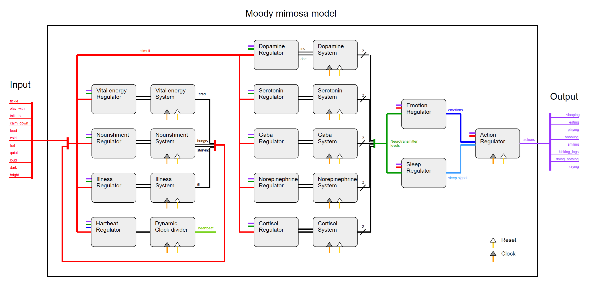

<!---

This file is used to generate your project datasheet. Please fill in the information below and delete any unused
sections.

You can also include images in this folder and reference them in the markdown. Each image must be less than
512 kb in size, and the combined size of all images must be less than 1 MB.
-->

## How it works

The original idea was quite simple: I wanted to design my first custom digital ASIC and implement a fun concept. Instead of developing something like an adder or encoder, I wanted to push the boundaries of what’s possible. A Tamagotchi-like, living creature—that’s the vision. A creature with an inner life, capable of interacting with the outside world, and something you can simply have fun with.

This original idea turned out to be a rabbit hole. What if the internal model closely follows biological processes and takes neurotransmitters and hormones into account, for example? Which neurotransmitters and hormons are relevantand what kind of emotions could emerge? How could sleep and hunger be modeled? What does the creature do? What is observable from the outside? How could illness be incorporated? How does something like this fit on the limited space of the chip? How could it be simulated or emulated on an FPGA? How could one still gain a complete view of the inner workings for debugging and testing? What might the hardware look like?

In the meantime, this project has evolved into several subprojects:

| Folder | Description |
| ------ | ----------- |
| `src`  | The digital design of the Mimosa model, including the Verilog source code and the additional information required for hardening. |
| `test` | Testing of the overall design, based on python and cocotb |
| `module_test`  | Testing of specific verilog submodules, based on python and cocotb |
| `fpga` | Additional files (tcl, xdc) for creating the FPGA design for an Artix-7 Alchitry board. For this part, I use the vivado command line utilities and the alchitry loader.|
| `simulation` | A simulation based on Pyverilator and PyQt6 with a graphical interface for optimizing the model (fine-tuning, feedback loops) and debugging the ASIC. Pyverilator uses the actual verilog sources, compiles them into a C/C++ application and allows to access it from within python. |
|`misc/mimosa_logger` | An STM32 application for an STM32G474 microcontroller to debug the ASIC. This logs all inputs and outputs, returns them via UART/FTDI, and allows for reconstructing the complete history using the simulation. I also added a CppUTest unit test for illustration.|

More details are described in the respective sections below. Whenever possible, I tried to install the required dependencies in the Dockerfile or with an additional batch script or added third-party repositories as git submodules, in order to comply with licensing regulations. However, the FPGA utilities (Vivado Suite from AMD) can only be installed with a personal account and therefore, you have to install it yourself. I also added makefiles or batch scripts in order to simplify building or running designs or applications.

### Moody mimosa

#### Overview

The moody mimosa model depends on several layers of abstraction. 

1. Actions: Sleeping, eating, playing, smiling, babbling, kicking legs, doing nothing, crying
2. Emotions: Happiness, excitement, stress, nervousness, boredom, anger, calmness, apathy
3. Stimuli: Input from the outer world, either from the environment (cold, hot, loud, bright) or 
   from an interacting indivduum (tickle, play with, calm down, talk to, feed). 
4. Basic resources: 
   - Neurotransmitters: Dopamine, Serotonin, Gamma-aminobutyric acid (Gaba), Norepinephrine
   - Hormons: Cortisol
   - Vital-energy, controlling sleepiness
   - Nourishment, controlling hunger
   - Illness, controlling whether the mimosa is ill or not

From the outher world, only one layer can be influenced directly (stimuli) and only one layer can be observed directly (actions). However, there are various indirect ways of how the stimuli influence the basic resources, emotions and actions and how the actions are influenced by emotions, basic resources and stimuli. The mimosa might cry because it is tired, ill, stressed, starving or angry because it cannot stand that it gets tickled all the time. You just don't know the reason. However, after some time, you develop an understanding of the creature and begin to realize what it might need.

#### Architecture

#### Implementation details

Each resource consists of a saturating counter (counting up or down) and a regulator, regulating whether it should count up or down, slow or fast, or remain unchanged. The main feedback behaviour is encoded in the regulators. I tried to mimick the biology of the neurotransmitters involved. The first-level, rapid stress response is mediated by norepinephrine (NE). If stress persists, the slower second-level response mediated by the hormone cortisol sets in and leads to long-term stress effects. The competing triple of serotonin, gaba and dopamine controls the mood and allows emotions such as happiness, excitement, boredom, anxiousness. During elevated periods of stress, all of them start to decrease, basically leading to a depressive state with negative emotions and without motivation. Hunger and tiredness also affects the neurotransmitters and even actions may lead to feedback effects, allowing both bottom-up and top-down emotion regulation ("smiling makes you feel better" vs. "if you feel good, you start smiling"). Although resources are themselv counters with 6-9 bits, only the upper two bits are used for emotion encoding and actions in order to limit gates needed. 

Emotions are basically a combinational encoding of the resource levels (0=very low, 1=moderately low, 2=moderately high, 3=very high) and stimuli. In rare cases, several emotions can be present at once. Strictly speaking, emotions would not be necessary for the model. However, it turned out to be much more intuitive and simpler, to decide the resulting action based on emotions rather than on resource levels.

Actions are modelled as a state-machine. State transitions are mediated by stimuli and/or emotions. In rare cases, neurotransmitter levels may even target actions directly. At times, there are several routes how states may change. For example, the mimosa starts to sleep if it is moderately tired and not too stressed. If it is, however, stressed or starving or if you can't stop irritating it or if there are environmental influences (noise, heat), it just can not sleep. It surely will get angry, stressed, nervous and probably starts to cry but it can not sleep. After some time, it will get way too tired (zero vital energy) and start sleeping superficially.

#### Pinout

For the tiny tapeout ASIC, the pins are assigned as described in the following tables:

| Pin      | Name        | Function                    |
| -------- | -------     | --------------------------- |
| clk      | clk         | Base clock                  |
| rst_n    | rst_n       | Reset, active low           |
| ui_in[0] | stimulus_0  | Interaction: Tickle         |
| ui_in[1] | stimulus_1  | Interaction: Play with      |
| ui_in[2] | stimulus_2  | Interaction: Talk to        |
| ui_in[3] | stimulus_3  | Interaction: Calm down      |
| ui_in[4] | stimulus_4  | Interaction: Feed           |
| ui_in[5] | stimulus_5  | Environment: Cool           |
| ui_in[6] | stimulus_6  | Environment: Hot            |
| ui_in[7] | stimulus_7  | Environment: Quiet          |

| Pin        | Dir | Name        | Function            |
| ---------- | --- | ----------- | ------------------- |
| uio_in[0]  | 0   | stimulus_8  | Environment: Loud   |
| uio_in[1]  | 0   | stimulus_9  | Environment: Dark   |
| uio_in[2]  | 0   | stimulus_10 | Environment: Bright |
| uio_out[3] | -   | -           | -                   |
| uio_out[4] | -   | -           | -                   |
| uio_out[5] | -   | -           | -                   |
| uio_out[6] | -   | -           | -                   |
| uio_out[7] | -   | -           | -                   |

| Pin       | Name       | Function                    |
| --------- | -------    | --------------------------- |
| uo_out[0] | action_0   | Action: Sleeping            |
| uo_out[1] | action_1   | Action: Eating              |
| uo_out[2] | action_2   | Action: Playing             |
| uo_out[3] | action_3   | Action: Smiling             |
| uo_out[4] | action_4   | Action: Babbling            |
| uo_out[5] | action_5   | Action: Kicking legs        |
| uo_out[6] | action_6   | Action: Doing nothing       |
| uo_out[7] | action_7   | Action: Crying              |

## How to test

Several ways

## External hardware

### Simulation
No hardware required. Just run `python simulation/mimosa_simulation.py`. Make sure that you have run the `scripts/set_up_dependencies.sh` script and that you run a X-Server (e.g. VcXsrv) if you are working with Docker and Windows.

### FPGA

Following external hardware is required: 

- Alchitry Au FPGA board
- Alchitry Br Adapter board
- Custom mimosa PCB [tbd] and USB-C cable

### ASIC

Apart from the actual ASIC, the following external hardware is required:

- Custom mimosa PCB [tbd] and USB-C cable